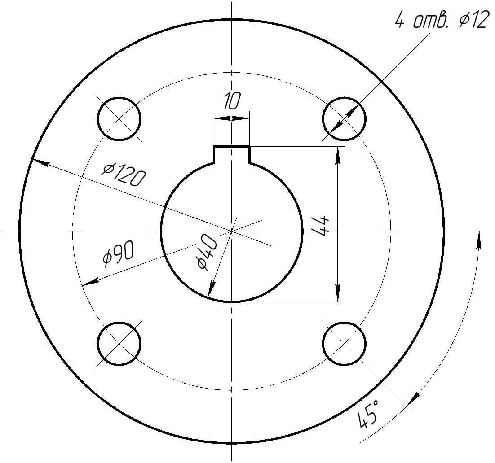

# КОМПАС-3D: скилл для Claude Code

**[English version](README.md)**

[Скилл для Claude Code](https://claude.com/claude-code) и Python-помощники, которые управляют **КОМПАС-3D v25** через его Python API (`ksapi`). Claude с ними строит фрагменты и чертежи: геометрию, размеры, заливку, экспорт в PNG. Плюс лаунчер для Linux, из-за которого КОМПАС больше не роняет Wayland-сессию.

| Платформа | Статус |
|---|---|
| Linux, КОМПАС в distrobox | Проверено на КОМПАС-3D v25 Home |
| Linux, КОМПАС без бокса | Должно работать (`KOMPAS_BOX=none`), с КОМПАСом не проверялось |
| Windows | Должно работать: АСКОН документирует там тот же Python API. Запускатель скриптов проверен на Windows с заглушкой вместо API, но с настоящим КОМПАСом на Windows ещё не пробовали. [Напиши](https://github.com/IsWaFF/kompas3d-skill/issues), как прошёл `examples/selftest.py`. |

<p align="center">
  
  <br><sub>Построено целиком через API скриптом <a href="examples/flange.py">examples/flange.py</a>: усечённая геометрия, размеры, проверка наслоений.</sub>
</p>

## Что внутри

| Путь | Что это |
|---|---|
| [`skill/kompas-3d/SKILL.md`](skill/kompas-3d/SKILL.md) | Сам скилл: настройка, порядок работы над чертежом и подводные камни API, проверенные на v25 |
| [`skill/kompas-3d/scripts/ks.py`](skill/kompas-3d/scripts/ks.py) | Помощники: `seg` `arc` `circle` `polygon` `text`, `rdim` `ddim` `ldim` `adim`, `fill`, `overlaps`, `export_png`, `save` |
| [`skill/kompas-3d/scripts/run.py`](skill/kompas-3d/scripts/run.py) | Запускает Python-скрипт против запущенного КОМПАСа: на Linux внутри distrobox, на Windows напрямую (`run.sh` — сокращение для Linux) |
| [`skill/kompas-3d/scripts/pdf_images.py`](skill/kompas-3d/scripts/pdf_images.py) | Достаёт рисунки и текст из PDF с заданием |
| [`launcher/kompas-nested`](launcher/kompas-nested) | Linux: запускает КОМПАС внутри Xephyr + openbox |
| [`examples/`](examples) | `flange.py` (картинка выше) и `selftest.py` (проверяет все помощники на твоём КОМПАСе) |
| [`tests/`](tests) | Проверка `run.py` в CI на Linux и Windows с заглушкой вместо API |

## Зачем

- **API почти не документирован, и часть вызовов делает не то, что обещает название.** Например:
  - `SetDirection` у дуги иногда рисует вторую часть окружности;
  - угловой размер по точкам меряет второй луч от начала координат листа;
  - диаметральный размер игнорирует `SetShelfAngle`/`SetShelfLength`;
  - растровый экспорт по умолчанию серый и зависает на модальном окне, если файл уже есть.

  В скилле записано, что реально работает, чтобы Claude не наступал на это каждый раз заново.
- **На Linux КОМПАС роняет swayfx.** Его контекстная панель — всплывающее окно XWayland, которое очень быстро появляется и исчезает. swayfx 0.6 на нём падает вместе со всей сессией. `kompas-nested` запускает КОМПАС во вложенном X-сервере, и композитор видит одно обычное окно.

## Что нужно

- КОМПАС-3D v25, хватит и Home.
- [Claude Code](https://claude.com/claude-code) для скилла. Помощники работают и без него.
- **Linux:**
  - [distrobox](https://distrobox.it/) (podman или docker) с боксом на Ubuntu 24.04, а в нём КОМПАС из apt-репозитория АСКОН по их инструкции. Проверено: v25 Home 25.0.1.2738 (`ascon-kompas3d-home-v25-full`).
  - В боксе для лаунчера: `xserver-xephyr openbox x11-xkb-utils`.
- **Windows:** 64-битный Python 3 (`ksapi.py` грузит 64-битную DLL).

## Установка

Linux:

```bash
# один раз: бокс (потом поставь в него КОМПАС по инструкции АСКОН)
distrobox create -n kompas-box -i ubuntu:24.04
distrobox enter kompas-box -- sudo apt install -y xserver-xephyr openbox x11-xkb-utils

git clone https://github.com/IsWaFF/kompas3d-skill
cd kompas3d-skill
./install.sh            # или ./install.sh --link, чтобы ставить симлинками
```

`install.sh` кладёт скилл в `~/.claude/skills/kompas-3d`, лаунчер в `~/.local/bin/kompas-nested` и добавляет пункт меню «КОМПАС-3D (во вложенном X)». Если там уже что-то лежит, оно переезжает в `~/.claude/backups/kompas-3d-install-<время>/`. Куда ставить, меняется через `CLAUDE_CONFIG_DIR`, `BIN_DIR` и `XDG_DATA_HOME`.

Windows (PowerShell):

```powershell
git clone https://github.com/IsWaFF/kompas3d-skill
cd kompas3d-skill
New-Item -ItemType Directory -Force "$env:USERPROFILE\.claude\skills" | Out-Null
Copy-Item -Recurse skill\kompas-3d "$env:USERPROFILE\.claude\skills\"
```

## Как пользоваться

Запусти КОМПАС (на Linux через `kompas-nested`) и попроси Claude Code, например: «начерти в компасе фланец Ø120 с четырьмя отверстиями». Скилл срабатывает на слова КОМПАС / чертёж / фрагмент.

Без Claude:

```bash
python3 skill/kompas-3d/scripts/run.py examples/selftest.py   # быстрая проверка всех помощников (на Windows: py вместо python3)
python3 skill/kompas-3d/scripts/run.py examples/flange.py ~/out   # -> ~/out/flange.frw, ~/out/flange.png
```

```python
import ks

ks.new_fragment()                 # эксперименты — в новом документе, не в чужом
ks.circle(0, 0, 30)               # контур + осевые
ks.ddim(0, 0, 30, 45)             # Ø60
assert ks.overlaps() == []        # нет наслоений
ks.save('/home/me/part.frw')
ks.export_png('/home/me/part.png')
```

Переменные окружения (путь установки, бокс, таймаут, настройки лаунчера) описаны в [английском README](README.md#configuration). Для sway есть [`launcher/sway.conf`](launcher/sway.conf).

## Ограничения

- С КОМПАСом проверено на одной системе: Garuda Linux, swayfx 0.6, КОМПАС-3D v25 Home. Другие композиторы, редакции и Windows должны работать, но с КОМПАСом не проверялись.
- Только 2D (фрагменты и чертежи).
- Linux: API нужен настоящий дисплей. Под Xvfb окно лицензий не завершается и порт API не открывается. Запускай в обычной графической сессии.

## Доработка

- Когда Claude узнаёт об API что-то новое, он дописывает `SKILL.md` или `ks.py` (см. «Improving this skill» в конце `SKILL.md`).
- После изменений кода надо прогнать:
  - `examples/selftest.py` на настоящем КОМПАСе;
  - `ruff check .`;
  - `shellcheck` для shell-скриптов.
- CI гоняет линтеры и `tests/probe.py` через `run.py` на Ubuntu и Windows.

## Лицензия

[MIT](LICENSE). КОМПАС-3D — товарный знак АСКОН. Проект с АСКОН не связан. `ksapi.py` и SDK КОМПАСа сюда не входят: они идут с твоей установкой КОМПАСа.

Сделано вместе с Claude Code.
